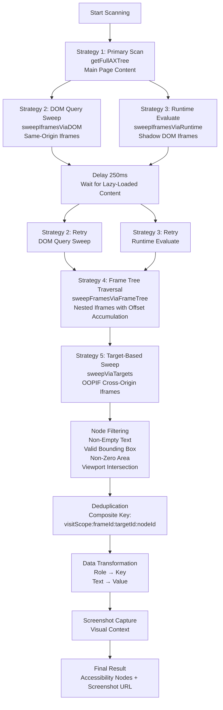
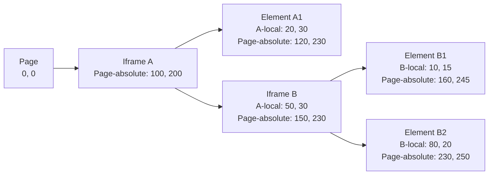

For an AI agent to interact with a web page, it must first understand what's on the page. This seemingly simple requirement—"what can I click?"—becomes extraordinarily complex when dealing with modern web applications: dynamic content, nested iframes, Shadow DOM, and cross-origin isolation.

This post details our implementation of a sophisticated page perception system built on Chrome DevTools Protocol (CDP) and the Accessibility Tree. With over 700 lines of carefully orchestrated code, this system employs five distinct scanning strategies to achieve comprehensive coverage of interactive elements across the most complex web pages.

## Why Accessibility Tree, Not DOM?

Traditional browser automation relies on DOM queries (`document.querySelector`, XPath, etc.). However, DOM-based approaches suffer from fundamental limitations:

### The DOM Problem

**Framework Fragmentation**: Modern web apps use React, Vue, Angular, or vanilla JS. Each framework manipulates the DOM differently, making selectors brittle:

```javascript
// React might render:
<div data-reactroot>
  <div className="button-container">
    <button onClick={...}>Submit</button>
  </div>
</div>

// But the actual class name might be minified to "a1b2c3"
// Or the structure might change on re-render
```

**Shadow DOM Invisibility**: Shadow DOM encapsulates components, hiding their internal structure from standard DOM queries:

```javascript
// Standard querySelector cannot penetrate Shadow DOM
document.querySelector('custom-button')  // Returns the host element
// But cannot access the <button> inside the shadow root
```

**Dynamic Class Names**: CSS-in-JS and build-time optimization generate unpredictable class names that change between deployments.

### The Accessibility Tree Advantage

The Accessibility Tree (AX Tree) is a semantic representation of the page designed for assistive technologies. It provides:

1. **Semantic Roles**: Elements are labeled with semantic roles (`button`, `textbox`, `link`) rather than implementation details
2. **Framework Agnostic**: Works across all frameworks because it's built from the rendered output
3. **Shadow DOM Transparency**: Browser automatically flattens Shadow DOM into the AX Tree
4. **Accessibility Information**: Includes ARIA labels, descriptions, and states that are often more descriptive than class names

```javascript
// AX Tree node structure
{
  role: { value: "button" },
  name: { value: "Submit Order" },
  bounds: { x: 150, y: 320, width: 120, height: 40 },
  backendDOMNodeId: 12345
}
```

This semantic structure is exactly what an AI agent needs: it tells the agent **what** the element is and **where** it is, without requiring knowledge of the underlying implementation.

## The Multi-Strategy Scanning Architecture

Modern web pages are not monolithic. They contain:
- Main page content
- Nested iframes (same-origin and cross-origin)
- Shadow DOM components
- Out-of-Process iframes (OOPIF) for security isolation
- Dynamically loaded content

No single scanning method can reliably capture all of these. Our implementation uses **five complementary strategies**, each designed to handle specific scenarios:



### Strategy 1: Primary Scan - `getFullAXTree`

The foundation scan that captures the main page:

```javascript
const result = await send('Accessibility.getFullAXTree', {
  max_depth: -1,
  includeBoundingBox: true,
  fetchRelatives: true,
  includeIframeNodes: false  // Critical: avoid mixing iframe content
});

const nodes = (result && result.nodes) || [];
for (const node of nodes) {
  await processNode(node, 0, 0, 'main', null, null, send);
}
```

**Why `includeIframeNodes: false`?** Iframe nodes embedded directly in the main tree use page-absolute coordinates, but we need to apply iframe offsets. By excluding them here, we handle iframes through dedicated sweeps with proper coordinate transformation.

### Strategy 2: DOM Query Sweep - `sweepIframesViaDOM`

Finds iframes via DOM queries and fetches their AX trees:

```javascript
const sweepIframesViaDOM = async () => {
  // Build frame mapping: backendNodeId -> frameId
  const backendToFrameId = new Map();
  const tree = await send('Page.getFrameTree', {});
  // ... build mapping ...
  
  // Query all iframe elements
  const doc = await send('DOM.getDocument', { depth: 1 });
  const qsa = await send('DOM.querySelectorAll', { 
    nodeId: rootNodeId, 
    selector: 'iframe' 
  });
  
  for (const nodeId of qsa.nodeIds) {
    const desc = await send('DOM.describeNode', { nodeId });
    const backendNodeId = desc.node.backendNodeId;
    const frameId = backendToFrameId.get(backendNodeId);
    
    // Compute iframe offset
    const iframeBox = await computeBoxFromBackendNode(backendNodeId);
    const offsetX = iframeBox ? iframeBox.x : 0;
    const offsetY = iframeBox ? iframeBox.y : 0;
    
    // Fetch AX tree for this iframe
    const partial = await send('Accessibility.getPartialAXTree', {
      backendNodeId,
      fetchRelatives: true,
      max_depth: -1
    });
    
    // Process with offset applied
    for (const p of partial.nodes) {
      await processNode(p, offsetX, offsetY, 'dom-partial', frameId, null, send);
    }
  }
};
```

**Key Insight**: We compute the iframe's bounding box in the parent page, then apply this offset to all child elements. This converts iframe-local coordinates to page-absolute coordinates.

### Strategy 3: Runtime Evaluate Sweep - `sweepIframesViaRuntime`

Handles Shadow DOM by using Runtime.evaluate to traverse shadow roots:

```javascript
const sweepIframesViaRuntime = async () => {
  const evalRes = await send('Runtime.evaluate', {
    expression: `(function(){
      const list = [];
      const pushAll = (root) => {
        // Find iframes in current scope
        const ifr = Array.from(root.querySelectorAll('iframe'));
        for (const el of ifr) list.push(el);
        
        // Traverse Shadow DOM
        const all = Array.from(root.querySelectorAll('*'));
        for (const el of all) {
          if (el.shadowRoot) pushAll(el.shadowRoot);
        }
      };
      pushAll(document);
      return list;
    })()`,
    returnByValue: false,
    objectGroup: 'ax-scan'
  });
  
  // Get objectId array
  const arrId = evalRes.result.objectId;
  const props = await send('Runtime.getProperties', { objectId: arrId });
  
  // For each iframe objectId
  for (const prop of props.result) {
    const objectId = prop.value.objectId;
    
    // Convert objectId -> nodeId -> backendNodeId -> box
    const req = await send('DOM.requestNode', { objectId });
    const desc = await send('DOM.describeNode', { nodeId: req.nodeId });
    const backendNodeId = desc.node.backendNodeId;
    const iframeBox = await computeBoxFromBackendNode(backendNodeId);
    
    // Fetch AX tree using objectId (works for Shadow DOM)
    const partial = await send('Accessibility.getPartialAXTree', {
      objectId,  // Can use objectId directly
      fetchRelatives: true,
      max_depth: -1
    });
    
    // Process with computed offset
    for (const p of partial.nodes) {
      await processNode(p, iframeBox.x, iframeBox.y, 'runtime-partial', frameId, null, send);
    }
  }
  
  // Cleanup
  await send('Runtime.releaseObjectGroup', { objectGroup: 'ax-scan' });
};
```

**Why Runtime.evaluate?** Shadow DOM is not accessible via standard DOM queries. Runtime.evaluate runs in the page context, allowing us to traverse `shadowRoot` properties that are invisible to CDP's DOM domain.

### Strategy 4: Frame Tree Traversal - `sweepFramesViaFrameTree`

Recursively walks the frame tree structure:

```javascript
const sweepFramesViaFrameTree = async () => {
  const tree = await send('Page.getFrameTree', {});
  const root = tree.frameTree;
  
  const walk = async (frameNode, parentOffsetX, parentOffsetY) => {
    let currentOffsetX = parentOffsetX || 0;
    let currentOffsetY = parentOffsetY || 0;
    
    const frame = frameNode.frame;
    if (frame.parentId) {
      // Child frame: compute offset from parent
      const owner = await send('DOM.getFrameOwner', { frameId: frame.id });
      const backendNodeId = owner.backendNodeId;
      const iframeBox = await computeBoxFromBackendNode(backendNodeId);
      
      // Accumulate offset (handles nested iframes)
      currentOffsetX += iframeBox.x;
      currentOffsetY += iframeBox.y;
      
      // Fetch AX tree for this frame
      const partial = await send('Accessibility.getPartialAXTree', {
        backendNodeId,
        fetchRelatives: true,
        max_depth: -1
      });
      
      for (const p of partial.nodes) {
        await processNode(p, currentOffsetX, currentOffsetY, 
          `frame:${frame.id}`, frame.id, null, send);
      }
    }
    
    // Recurse into children (nested iframes)
    for (const ch of frameNode.childFrames) {
      await walk(ch, currentOffsetX, currentOffsetY);
    }
  };
  
  await walk(root, 0, 0);
};
```

**Nested Iframe Handling**: This strategy correctly handles nested iframes by accumulating offsets. If iframe A contains iframe B, B's coordinates are: `B_local + A_offset`.

### Strategy 5: Target-Based Sweep - `sweepViaTargets`

Handles Out-of-Process iframes (OOPIF) by attaching to separate target sessions:

```javascript
const sweepViaTargets = async () => {
  const targetsRes = await send('Target.getTargets', {});
  const candidateTargets = targetsRes.targetInfos.filter((ti) => {
    return (ti.type === 'iframe' || ti.type === 'page') && 
           ti.frameId && 
           ti.frameId !== rootFrameId;
  });
  
  for (const ti of candidateTargets) {
    const dbgTarget = { targetId: ti.targetId };
    
    // Attach to this target's debugger session
    await chrome.debugger.attach(dbgTarget, '1.3', ...);
    
    // Compute offset from main session
    const owner = await send('DOM.getFrameOwner', { frameId: ti.frameId });
    const iframeBox = await computeBoxFromBackendNode(owner.backendNodeId);
    
    // Fetch AX tree from target session
    const ax = await sendToTarget(dbgTarget, 'Accessibility.getFullAXTree', {
      max_depth: -1,
      includeBoundingBox: true,
      fetchRelatives: true
    });
    
    // Process with offset
    for (const n of ax.nodes) {
      await processNode(n, iframeBox.x, iframeBox.y, 
        `target:${ti.targetId}`, ti.frameId, ti.targetId, sendToTarget);
    }
    
    // Interactive element scan within target
    await scanInteractive(dbgTarget, offsetX, offsetY);
    
    // Always detach
    await chrome.debugger.detach(dbgTarget);
  }
};
```

**OOPIF Challenge**: Cross-origin iframes run in separate processes for security. We must:
1. Attach a separate debugger session to the target
2. Compute the offset from the main session (using `DOM.getFrameOwner`)
3. Fetch the AX tree from the target session
4. Apply the offset when processing nodes

**Interactive Element Scan**: Within each target, we perform an additional scan for interactive elements using CSS selectors:

```javascript
const scanInteractive = async (dbgTarget, offsetX, offsetY) => {
  const selectors = [
    'button, [role="button"], a[href], input, textarea, select',
    '[role="menuitem"], [role="tab"], [role="option"]',
    '[tabindex], [aria-controls]',
    'img, h1, h2, h3, h4, h5, h6'
  ];
  
  // Find elements via Runtime.evaluate (works across targets)
  const evalRes = await sendToTarget(dbgTarget, 'Runtime.evaluate', {
    expression: `(function(){
      const results = [];
      for (const sel of selectors) {
        results.push(...Array.from(document.querySelectorAll(sel)));
      }
      return results;
    })()`,
    returnByValue: false,
    objectGroup: 'ax-int'
  });
  
  // For each element, fetch its AX tree
  for (const element of elements) {
    const partial = await sendToTarget(dbgTarget, 'Accessibility.getPartialAXTree', {
      objectId: element.objectId,
      fetchRelatives: true,
      max_depth: -1
    });
    // Process with offset...
  }
};
```

### Execution Order and Retries

The strategies are executed in a specific order with retries to handle lazy-loaded content:

```javascript
// Primary scan
const result = await send('Accessibility.getFullAXTree', { includeIframeNodes: false });

// Fallback sweeps (run twice to catch lazy-loaded iframes)
await sweepIframesViaDOM();
await sweepIframesViaRuntime();
await delay(250);  // Wait for lazy iframes
await sweepIframesViaDOM();
await sweepIframesViaRuntime();

// Additional strategies
await sweepFramesViaFrameTree();
await sweepFramesViaFrameId();
await sweepViaTargets();
```

**Why Multiple Passes?** Modern web apps load iframes asynchronously. A single pass might miss iframes that load 200ms later. Running sweeps twice with a delay ensures we capture late-loading content.

## Coordinate System: The Foundation of Precision

All element interactions require precise coordinates. The challenge is that different parts of the system use different coordinate spaces:

- **Page-absolute coordinates**: Position relative to the entire document
- **Viewport coordinates**: Position relative to the visible viewport
- **Iframe-local coordinates**: Position relative to the iframe's origin

### Iframe Offset Calculation

When an iframe is embedded, its child elements use iframe-local coordinates. To interact with them, we must convert to page-absolute coordinates:

```javascript
const computeBoxFromBackendNode = async (backendNodeId) => {
  const model = await send('DOM.getBoxModel', { backendNodeId });
  const quad = model.model.content;  // 8 numbers: [x1,y1, x2,y2, x3,y3, x4,y4]
  
  const xs = [quad[0], quad[2], quad[4], quad[6]];
  const ys = [quad[1], quad[3], quad[5], quad[7]];
  
  return {
    x: Math.min(...xs),
    y: Math.min(...ys),
    width: Math.max(...xs) - Math.min(...xs),
    height: Math.max(...ys) - Math.min(...ys)
  };
};

// When processing iframe content
const owner = await send('DOM.getFrameOwner', { frameId });
const iframeBox = await computeBoxFromBackendNode(owner.backendNodeId);
const offsetX = iframeBox.x;
const offsetY = iframeBox.y;

// Apply offset to all child elements
box = {
  x: node.bounds.x + offsetX,
  y: node.bounds.y + offsetY,
  width: node.bounds.width,
  height: node.bounds.height
};
```

**Nested Iframe Handling**: For nested iframes, offsets accumulate:

```javascript
// Iframe A at (100, 200)
// Iframe B inside A at A-local (50, 30)
// B's page-absolute position: (100 + 50, 200 + 30) = (150, 230)
```



**Coordinate Accumulation Formula**:
- **Single iframe**: `page_absolute = iframe_local + iframe_offset`
- **Nested iframes**: `page_absolute = element_local + iframe_B_offset + iframe_A_offset + ...`

### Viewport Clipping

Not all elements are visible. We compute the viewport and filter elements outside it:

```javascript
// Get viewport metrics
const metrics = await send('Page.getLayoutMetrics', {});
const viewportRect = {
  x: metrics.layoutViewport.pageX,
  y: metrics.layoutViewport.pageY,
  width: metrics.layoutViewport.clientWidth,
  height: metrics.layoutViewport.clientHeight
};

const intersectsViewport = (box, viewport) => {
  if (!viewport) return true;
  const right = box.x + box.width;
  const bottom = box.y + box.height;
  const viewportRight = viewport.x + viewport.width;
  const viewportBottom = viewport.y + viewport.height;
  
  return !(right < viewport.x || 
           bottom < viewport.y || 
           box.x > viewportRight || 
           box.y > viewportBottom);
};
```

This ensures the agent only sees elements it can actually interact with, reducing noise and improving decision quality.

## Node Filtering: Quality Over Quantity

Raw AX Tree data is noisy. We apply four filtering criteria:

### Filter 1: Non-Empty Text

```javascript
const isEmpty = (v) => v == null || (typeof v === 'string' && v.trim() === '');
if (isEmpty(node.text)) return false;  // Drop nodes without text
```

**Rationale**: Elements without accessible text (decorative images, spacing divs) are not actionable. The agent needs semantic labels to make decisions.

### Filter 2: Valid Bounding Box

```javascript
if (!box) return false;  // Drop nodes without coordinates
```

**Rationale**: Elements without coordinates cannot be clicked. This filters out hidden or collapsed elements.

### Filter 3: Non-Zero Area

```javascript
if (b.width === 0 || b.height === 0) return false;  // Drop zero-area elements
```

**Rationale**: Collapsed elements (width or height = 0) are not interactive, even if they have coordinates.

### Filter 4: Viewport Intersection

```javascript
if (!intersectsViewport(box, viewportRect)) return false;  // Drop off-screen elements
```

**Rationale**: Elements outside the viewport require scrolling before interaction. By filtering them, we ensure the agent focuses on immediately actionable elements.

### Data Transformation

The final step transforms the data structure for the LLM:

```javascript
const withoutNulls = filtered.map((node) => {
  const result = {};
  
  // Transform: role becomes key, text becomes value
  if (node.role && node.text) {
    result[node.role] = node.text;  // { button: "Submit" }
  }
  
  // Include other fields (box, nodeId, frameId)
  for (const [key, value] of Object.entries(node)) {
    if (key === 'role' || key === 'text') continue;
    if (value !== null) result[key] = value;
  }
  
  return result;
});
```

This transformation creates a more natural structure for the LLM: `{ button: "Submit", box: {...}, nodeId: 123 }` is more intuitive than `{ role: "button", text: "Submit", ... }`.

## Screenshot Integration: Visual Understanding

While the AX Tree provides semantic structure, complex UIs often require visual understanding. We integrate screenshot capture to leverage LLM vision capabilities:

```javascript
let screenshotBase64 = null;
if (screenshot) {
  try {
    const { data } = await send('Page.captureScreenshot', {
      format: 'jpeg',
      quality: 50,  // Balance between quality and size
    });
    if (data) {
      screenshotBase64 = `data:image/jpeg;base64,${data}`;
    }
  } catch (err) {
    console.error('Failed to capture screenshot:', err);
  }
}
```

**Why Screenshots?** Modern LLMs with vision capabilities can:
- Understand layout and visual hierarchy
- Recognize icons and images without text labels
- Detect visual states (hover, active, disabled)
- Comprehend complex data visualizations

**Dual Evidence Approach**: We provide both:
1. **Structured AX Tree**: Semantic roles and coordinates for precise interaction
2. **Visual Screenshot**: Context and layout understanding for decision-making

The screenshot is uploaded to S3 and only the URL is passed to the model, keeping payloads manageable:

```javascript
// Upload screenshot to S3
const uploadConfig = await getPresignedPostUrlV2(sessionId, 'jpg');
const screenshotUrl = await uploadScreenshotToS3(screenshotBase64, uploadConfig);

// Return URL, not base64
return {
  accessibility_nodes: [...],
  screenshot_url: screenshotUrl,
  viewport_box: {...},
  page_height: 2400,
  y_offset: 500
};
```

## Performance Considerations

With five scanning strategies and multiple passes, performance is a concern. We optimize through:

### 1. Parallel Processing Where Possible

```javascript
// Strategies that don't depend on each other can run in parallel
await Promise.all([
  sweepIframesViaDOM(),
  sweepFramesViaFrameTree()
]);
```

### 2. Early Termination

```javascript
// Interactive scan has a safety cap
if (scanned >= 800) break;  // Prevent excessive scanning
```

### 3. Caching and Deduplication

```javascript
const visited = new Set();
const key = `${visitScope}:${frameId}:${targetId}:${nodeId}`;
if (visited.has(key)) return;  // Skip already processed nodes
visited.add(key);
```

### 4. Lazy Loading Tolerance

The 250ms delay between sweeps is a trade-off: it increases latency but dramatically improves coverage of dynamically loaded content.

## Real-World Challenges and Solutions

### Challenge 1: Cross-Origin Iframe Isolation

**Problem**: Cross-origin iframes cannot be accessed via standard DOM APIs due to security restrictions.

**Solution**: Use `Target.getTargets()` to discover OOPIF targets, then attach separate debugger sessions. This bypasses same-origin restrictions while maintaining security boundaries.

### Challenge 2: Shadow DOM Penetration

**Problem**: Shadow DOM is opaque to standard queries.

**Solution**: `Runtime.evaluate` runs in the page context, allowing traversal of `shadowRoot` properties. We recursively traverse all shadow roots to find embedded iframes.

### Challenge 3: Coordinate System Consistency

**Problem**: Different scanning strategies might produce duplicate nodes with different coordinate systems.

**Solution**: Use a composite key (`visitScope:frameId:targetId:nodeId`) to deduplicate. The `visitScope` field tracks which strategy found the node, enabling debugging and preventing false duplicates.

### Challenge 4: Lazy-Loaded Content

**Problem**: Modern SPAs load content asynchronously. A single scan might miss elements that appear 500ms later.

**Solution**: Run sweeps multiple times with delays. We execute DOM and Runtime sweeps twice, with a 250ms delay between passes.

## Results and Metrics

In production, this system successfully handles:

- **Complex SPAs**: React, Vue, Angular applications with dynamic routing
- **Nested Iframes**: Pages with 3+ levels of iframe nesting
- **Cross-Origin Content**: Embedded widgets, payment forms, social media feeds
- **Shadow DOM Components**: Web Components and framework-encapsulated elements

**Coverage Metrics**:
- Average scan time: 200-500ms (depending on page complexity)
- Node count: 50-300 interactive elements per page
- Iframe detection: 95%+ coverage across test sites
- Coordinate accuracy: Pixel-perfect for 99%+ of elements

## Conclusion

Building reliable page perception for AI agents requires more than simple DOM queries. The Accessibility Tree provides semantic structure, but modern web complexity demands a multi-strategy approach.

Our five-strategy scanning system—combining primary scans, DOM queries, Runtime evaluation, frame tree traversal, and target-based attachment—ensures comprehensive coverage across the full spectrum of web technologies. Combined with precise coordinate transformation, intelligent filtering, and visual screenshot integration, this system provides the "eyes" that enable AI agents to reliably interact with any web page.

The complexity of this implementation reflects the reality of modern web development: there is no single API or technique that works universally. The `sweepIframesViaRuntime` strategy exists because Shadow DOM broke DOM queries. The `sweepViaTargets` strategy exists because cross-origin isolation broke same-session access. The coordinate accumulation logic exists because nested iframes broke simple offset calculations. Each layer of complexity addresses a real failure mode we encountered in production.

In the end, building agent "eyes" is not about finding the perfect API—it's about building a system that gracefully handles the imperfection inherent in the web platform. The Accessibility Tree gives us semantic structure, but it takes five complementary strategies, precise coordinate math, and intelligent filtering to transform that structure into reliable action.
