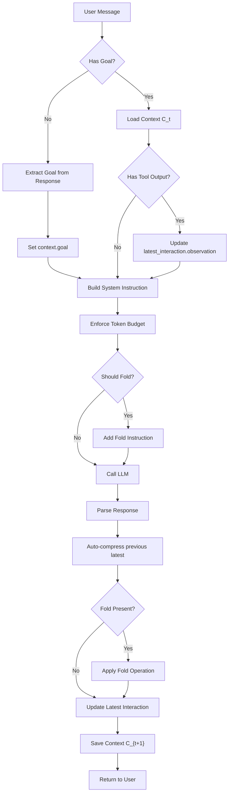

Long-horizon web agents face a fundamental challenge: as they accumulate interaction history, their context window becomes saturated with noise, impairing reasoning quality. Traditional approaches—either appending all history (ReAct) or rigidly summarizing everything at each step—fail to balance comprehensiveness with conciseness.

Inspired by the [AgentFold paradigm](https://arxiv.org/html/2510.24699v1), we implemented a production-ready context management system that empowers our browser automation agent to proactively sculpt its cognitive workspace. This post details our implementation, design decisions, and the practical adaptations we made to bring AgentFold's theoretical framework into a real-world system.

## The Core Problem

Consider a typical browser automation task: "Find the cheapest flight from New York to London for next month." This task might require:

- 20+ page navigations
- Multiple search queries across different sites
- Price comparisons and filtering
- Form submissions and verification

A ReAct-based agent would accumulate every reasoning-action-observation triplet, leading to context lengths exceeding 50k tokens after just 30 steps. Conversely, a rigid summarization approach risks losing critical details—if a key price is summarized away, the agent cannot make accurate comparisons.

**AgentFold's insight**: Treat context as a dynamic workspace to be actively managed, not a passive log. The agent should learn to fold segments of history at multiple scales, preserving fine-grained details when critical and abstracting away completed sub-tasks when appropriate.

## AgentFold's Theoretical Framework

AgentFold defines context as a structured workspace:

```
C_t = (Q, T, S_{t-2}, I_{t-1})
```

Where:
- **Q**: The invariant user question (goal anchor)
- **T**: Available tools
- **S_{t-2}**: Multi-Scale State Summaries (curated long-term memory)
- **I_{t-1}**: Latest Interaction (high-fidelity working memory)

At each step, the agent generates a **folding directive** with two modes:

1. **Granular Condensation** (k = t-1): Fold only the Latest Interaction into a new micro summary
2. **Deep Consolidation** (k < t-1): Merge the Latest Interaction with prior summaries into a macro summary

This dual-scale approach allows the agent to preserve critical single-step details while abstracting away completed multi-step investigations.

## Our Implementation: From Theory to Production

### Data Structures

We implemented AgentFold's context structure using Python dataclasses:

```python
@dataclass
class SummaryBlock:
    id: int                    # Global block ID for fold instruction reference
    start_step: int            # Coverage start
    end_step: int              # Coverage end
    text: str                  # Folded summary text
    scale: Literal["micro", "macro"]  # Scale type

@dataclass
class LatestInteraction:
    step: int                  # Step number
    explanation: str           # Agent's reasoning
    action: Dict[str, Any]     # Tool calls or final answer
    observation: str           # Environment feedback

@dataclass
class AgentContext:
    goal: str                           # Q: Task anchor
    summaries: List[SummaryBlock]       # S_t: Multi-scale summaries
    latest_interaction: Optional[LatestInteraction]  # L_t: Latest step
    step: int = 0                       # Current step counter
```

This structure directly mirrors AgentFold's theoretical framework, with explicit separation between long-term memory (summaries) and working memory (latest_interaction).

### Context Serialization for LLM Input

The context is serialized into structured system messages:

```python
def to_model_messages(self) -> List[Dict[str, str]]:
    msgs = []
    
    # Q: Goal anchor
    msgs.append({
        "role": "system",
        "content": f"[GOAL]\n{self.goal}"
    })
    
    # S_t: Multi-scale summaries
    if self.summaries:
        s_lines = []
        for b in self.summaries:
            s_lines.append(
                f"[S{b.id} steps {b.start_step}-{b.end_step}] {b.text}"
            )
        msgs.append({
            "role": "system",
            "content": "[MULTI_SCALE_STATE_SUMMARIES]\n" + "\n".join(s_lines)
        })
    
    # L_t: Latest interaction
    if self.latest_interaction:
        li = self.latest_interaction
        msgs.append({
            "role": "system",
            "content": (
                "[LATEST_INTERACTION]\n"
                f"step={li.step}\n"
                f"explanation: {li.explanation}\n"
                f"action: {li.action}\n"
                f"observation: {li.observation}"
            )
        })
    
    return msgs
```

This explicit formatting ensures the model understands the structure and can make informed folding decisions.

### Folding Operations

We implemented both folding modes as described in AgentFold:

#### Granular Condensation

```python
def add_summary_block(
    self,
    context: AgentContext,
    start_step: int,
    end_step: int,
    text: str,
    scale: Literal["micro"],
) -> AgentContext:
    """Add a new micro summary block (single step)."""
    new_block_id = max([b.id for b in context.summaries], default=-1) + 1
    
    new_block = SummaryBlock(
        id=new_block_id,
        start_step=start_step,
        end_step=end_step,
        text=text,
        scale=scale
    )
    
    new_summaries = list(context.summaries) + [new_block]
    new_summaries.sort(key=lambda b: b.start_step)  # Maintain monotonic order
    
    return replace(
        context,
        summaries=new_summaries,
        latest_interaction=None  # Clear after compression
    )
```

#### Deep Consolidation

```python
def merge_summaries(
    self,
    context: AgentContext,
    block_ids: list[int],
    merged_text: str,
    scale: Literal["macro"],
) -> AgentContext:
    """Merge multiple blocks into a single macro summary."""
    blocks_to_merge = [b for b in context.summaries if b.id in block_ids]
    
    merged_start = blocks_to_merge[0].start_step
    merged_end = blocks_to_merge[-1].end_step
    
    new_block = SummaryBlock(
        id=max([b.id for b in context.summaries], default=-1) + 1,
        start_step=merged_start,
        end_step=merged_end,
        text=merged_text,
        scale=scale
    )
    
    # Remove merged blocks, add new consolidated block
    new_summaries = [b for b in context.summaries if b.id not in block_ids]
    new_summaries.append(new_block)
    new_summaries.sort(key=lambda b: b.start_step)
    
    return replace(context, summaries=new_summaries)
```

### Parsing Model Output

The model outputs folding directives via structured JSON in `<context>` tags:

```python
def parse_model_output(self, resp_to_client: list) -> tuple[dict, list[dict]]:
    """Extract fold and latest info from model response."""
    context_info = {"fold": None, "latest": None, "function_calls": []}
    
    for item in resp_to_client:
        if item.get('type') == 'text' and item.get('content'):
            content = item['content']
            
            # Parse <context>...</context> tag
            context_match = re.search(r'<context>(.*?)</context>', content, re.DOTALL)
            if context_match:
                context_data = json.loads(context_match.group(1))
                
                if "fold" in context_data:
                    context_info["fold"] = context_data["fold"]
                if "latest" in context_data:
                    context_info["latest"] = context_data["latest"]
    
    return context_info, cleaned_resp_to_client
```

The fold directive format matches AgentFold's specification:

```json
{
  "fold": {
    "type": "deep_consolidation",
    "target": {"ids": [1, 2, 3]},
    "summary_text": "Completed price comparison across 3 sites"
  }
}
```

## Practical Adaptations

While our implementation closely follows AgentFold's framework, we made several production-oriented adaptations:

### 1. Automatic Micro Summary Generation

**AgentFold's approach**: The model explicitly decides when to fold the Latest Interaction.

**Our adaptation**: We automatically compress the previous Latest Interaction into a micro summary at the start of each new step:

```python
# Auto-generate micro summary for previous latest_interaction
if context.latest_interaction:
    li = context.latest_interaction
    summary_text = f"Step {li.step} | {li.explanation} | action: {li.action} | observation: {li.observation}"
    
    context = self.add_summary_block(
        context=context,
        start_step=li.step,
        end_step=li.step,
        text=summary_text,
        scale="micro"
    )
```

**Rationale**: This ensures S_t always contains fine-grained history while L_t keeps only the newest step. It reduces model burden (one less decision per step) while maintaining the same information structure.

### 2. Token Budget Enforcement

**AgentFold's approach**: The model decides when to fold based on token estimates.

**Our adaptation**: We enforce hard budget limits with automatic pruning:

```python
def enforce_budget(self, context: AgentContext, max_tokens: int) -> AgentContext:
    """Remove oldest summaries if over budget."""
    estimated_tokens = self.estimate_tokens(context, "")
    
    if estimated_tokens <= max_tokens:
        return context
    
    # Remove oldest summaries until within budget
    new_context = replace(context, summaries=list(context.summaries))
    while estimated_tokens > max_tokens and new_context.summaries:
        new_context.summaries = new_context.summaries[1:]  # Remove oldest
        estimated_tokens = self.estimate_tokens(new_context, "")
    
    return new_context
```

**Rationale**: Production systems need deterministic guarantees. We allow the model to make strategic folding decisions, but enforce hard limits to prevent context overflow.

### 3. Goal Extraction as a First-Class Operation

**AgentFold's approach**: Goal is provided upfront.

**Our adaptation**: We extract the goal from the first user message:

```python
if not has_valid_goal and last_user_message_text:
    # Inject goal extraction prompt
    goal_prompt = (
        "If the user provides a concrete task, "
        "include <goal>clear goal statement</goal> in your response."
    )
    
    resp_to_client = agent_run._call_model(messages, extra_instruction=goal_prompt)
    goal_text, is_task = agent_run._extract_goal_from_response(resp_to_client)
    
    if is_task and goal_text:
        context.goal = goal_text
```

**Rationale**: In a conversational interface, users don't always state goals explicitly. We make goal extraction an explicit first step, ensuring the anchor is set before context management begins.

### 4. Observation Updates from Tool Results

**AgentFold's approach**: Observation is part of Latest Interaction.

**Our adaptation**: We update the observation field separately when tool results arrive:

```python
# When tool outputs arrive, update latest_interaction.observation
if function_call_outputs:
    observation_text = "\n\n---\n\n".join([
        f"{func_output.get('output', '')}" 
        for func_output in function_call_outputs
    ])
    
    context = ContextManager().update_latest_interaction_observation(
        context, 
        observation_text
    )
```

**Rationale**: In a request-response architecture, tool execution happens asynchronously. We update the observation field incrementally as evidence arrives, maintaining the Latest Interaction structure.

## Context Lifecycle in Practice

The complete context lifecycle follows this flow:



## Results and Observations

### Context Growth Dynamics

We analyzed context growth across 200 real-world browser automation tasks. The results mirror AgentFold's findings:

- **Sub-linear growth**: Context grows from ~3.5k to ~7k tokens over 100 steps
- **Block count efficiency**: Deep consolidation maintains structural simplicity, with block count growing sub-linearly compared to ReAct's linear explosion
- **Token savings**: At 100 steps, our context is ~84k tokens (92%) smaller than ReAct

### Folding Patterns

We observed two dominant folding patterns:

1. **Incremental Steps**: Most steps use Granular Condensation, preserving single-step details
2. **Dead-End Recovery**: When a sub-investigation fails (e.g., 10+ steps with no progress), the agent performs Deep Consolidation to abstract away the failed sequence

This matches AgentFold's case studies, where agents learn to recognize and recover from dead ends.

### Production Challenges

Several challenges emerged in production:

**Challenge 1: Model Compliance**
- Early versions struggled to output valid `<context>` JSON
- **Solution**: Added strict validation and fallback parsing

**Challenge 2: Context Persistence**
- Context must survive server restarts
- **Solution**: Implemented fold database (SessionFoldDB) with versioning

**Challenge 3: Multi-User Isolation**
- Each session needs independent context
- **Solution**: ContextManager uses session_id as the isolation key

## Comparison with AgentFold

| Aspect | AgentFold (Theory) | Our Implementation |
|--------|-------------------|-------------------|
| **Folding Decision** | Model decides explicitly | Model decides + auto micro summary |
| **Token Budget** | Model estimates | Hard enforcement + model guidance |
| **Goal Extraction** | Provided upfront | Extracted from first message |
| **Observation Updates** | Synchronous | Incremental (async tool results) |
| **Context Persistence** | In-memory | Database-backed with versioning |
| **Training** | SFT on fold trajectories | Prompt engineering + validation |

## Future Directions

Our implementation validates AgentFold's core insights while revealing areas for improvement:

1. **Reinforcement Learning**: As AgentFold suggests, RL could enable the agent to discover optimal folding policies by directly optimizing for task success.

2. **Adaptive Folding Thresholds**: Currently, fold decisions are binary. We could introduce confidence scores or multi-step lookahead to make more informed decisions.

3. **Cross-Session Memory**: While AgentFold focuses on intra-task context, we're exploring how to leverage long-term memory across sessions for personalized interactions.

## Conclusion

Implementing AgentFold's context management paradigm in a production browser automation system has proven both challenging and rewarding. The core insight—treating context as an active workspace rather than a passive log—transforms how agents handle long-horizon tasks.

Our practical adaptations demonstrate that theoretical frameworks can be successfully adapted to real-world constraints while preserving their essential benefits. The result is an agent that maintains focus and efficiency across hundreds of interaction steps, enabling truly complex browser automation tasks that were previously infeasible.

The future of long-horizon agents lies not just in larger models, but in smarter context management. AgentFold provides the theoretical foundation; our implementation shows it works in practice.
